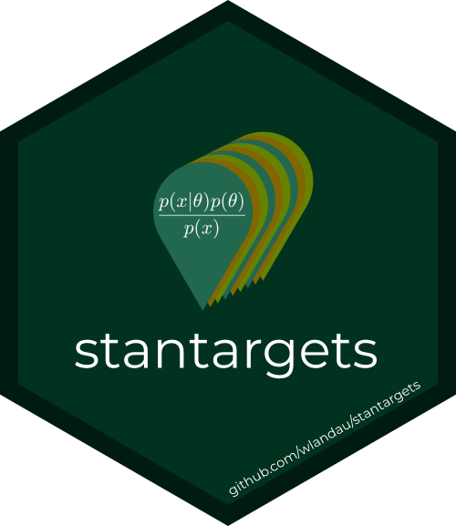

```{r, include = FALSE}
knitr::opts_chunk$set(
  collapse = TRUE,
  comment = "#>",
  fig.path = "man/figures/README-",
  out.width = "100%"
)
```

# stantargets 

[](https://wlandau.github.io/targetopia/)
[](https://cran.r-project.org/package=stantargets)
[](https://www.repostatus.org/#active)
[](https://github.com/wlandau/stantargets/actions?query=workflow%3Acheck)
[](https://codecov.io/gh/wlandau/targets)
[](https://github.com/wlandau/stantargets/actions?query=workflow%3Alint)

The `stantargets` R package is an extension to [`targets`](https://github.com/wlandau/targets) and [`cmdstanr`](https://github.com/stan-dev/cmdstanr) for Bayesian data analysis. `stantargets` makes it super easy to set up useful scalable Stan pipelines that automatically parallelize the computation and skip expensive steps when the results are already up to date. Minimal custom code is required, and there is no need to manually configure branching, so usage is much easier than [`targets`](https://github.com/wlandau/targets) alone. `stantargets` can access all of [`cmdstanr`](https://github.com/stan-dev/cmdstanr)'s major algorithms (MCMC, variational Bayes, and optimization) and it supports both single-fit workflows and multi-rep simulation studies.

## Prerequisites

1. The [prerequisites of the `targets` R package](https://wlandau.github.io/targets/#prerequisites).
1. Basic familiarity with [`targets`](https://wlandau.github.io/targets/): watch minutes 6 through 40 of [this video](https://youtu.be/Gqn7Xn4d5NI), then read [this chapter](https://wlandau.github.io/targets-manual/walkthrough.html) of the [user manual](https://wlandau.github.io/targets-manual/).
1. Familiarity with Bayesian Statistics and [Stan](https://mc-stan.org/). Prior knowledge of [`cmdstanr`](https://mc-stan.org/cmdstanr/) helps.

## How to get started

Read the `stantargets` tutorial vignettes [here](https://wlandau.github.io/stantargets/articles/mcmc.html) and [here](https://wlandau.github.io/stantargets/articles/mcmc_rep.html), then use <https://wlandau.github.io/stantargets/> as a reference while constructing your own worklows.


## Installation

Install the GitHub development version to access the latest features and patches.

```{r, eval = FALSE}
remotes::install_github("wlandau/stantargets")
```

The [`cmdstan`](https://github.com/stan-dev/cmdstan) command line interface is also required.

```{r, eval = FALSE}
cmdstanr::install_cmdstan()
```

## Usage

First, write a [`_targets.R` file](https://wlandau.github.io/targets-manual/walkthrough.html) that loads your packages, defines a function to generate [Stan](https://mc-stan.org/) data, and lists a pipeline of targets. The target list can call target factories like [`tar_stan_mcmc()`](https://wlandau.github.io/stantargets/reference/tar_stan_mcmc.html) as well as ordinary targets with [`tar_target()`](https://wlandau.github.io/targets/reference/tar_target.html).

```{r, eval = FALSE}
# _targets.R
library(targets)
library(stantargets)

generate_data <- function() {
  true_beta <- stats::rnorm(n = 1, mean = 0, sd = 1)
  x <- seq(from = -1, to = 1, length.out = n)
  y <- stats::rnorm(n, x * true_beta, 1)
  list(n = n, x = x, y = y, true_beta = true_beta)
}

list(
  tar_stan_mcmc(example, "x.stan", tar_stan_example_data())
)
```

Run [`tar_visnetwork()`](https://wlandau.github.io/targets/reference/tar_visnetwork.html) to check `_targets.R` for correctness, then call [`tar_make()`](https://wlandau.github.io/targets/reference/tar_make.html) to run the pipeline. Access the results using [`tar_read()`](https://wlandau.github.io/targets/reference/tar_read.html), e.g. `tar_read(tar_read(example_summary_x)`. Visit [this vignette](https://wlandau.github.io/stantargets/articles/mcmc.html) to read more about this example.

## Participation

Development is a community effort, and we welcome discussion and contribution. By participating in this project, you agree to abide by the [code of conduct](https://github.com/wlandau/stantargets/blob/main/CODE_OF_CONDUCT.md) and the [contributing guide](https://github.com/wlandau/stantargets/blob/main/CONTRIBUTING.md).

## Citation

```{r}
citation("stantargets")
```
